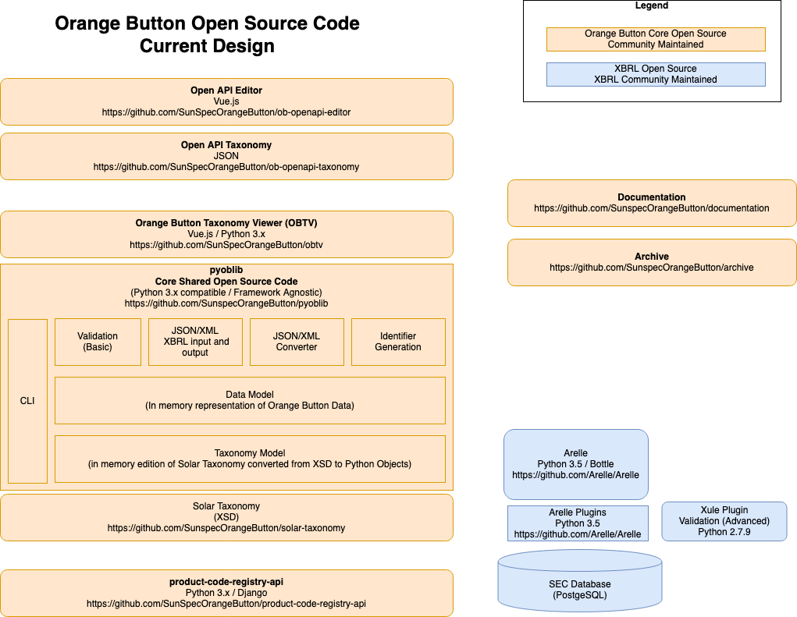

# Orange Button Design

**Three types of code are available:**

1. Orange Button Core Open Source is maintained by the Orange Button Open Source community.  It includes Apache 2.0 licensed libraries.  The libraries are written in Python and compatible with both Python 2.7.x and 3.x implementations.  The main code library - pyoblib - includes an in memory data model, in memory meta-data about the solar taxonomy, and common tools (XML/JSON input output, conversion, vaidation, identifier generation, etc...).  Pyoblib intentionally does not include an on disk database (due to the large discrepancy on implementation intentions) although it may at a later date.  The core libraries should leverage the Python standard library to the extent possible to minimize required dependencies.  The Solar Taxonomy itself (an XSD based specification) is also published in the core shared area.  Python Programs may also be included outside of the core libaries and the programs may be compatible with any python implementation.  There is also an option to develop alternative implementations in other programming languages although no other implementation currently exists.
2. Orange Button Reference edition is an end to end working REST server programmed in Python using the Django framework running on a MySQL database.  The reference edition is primarily built and operated by SunSpec Alliance.  The reference edition is neither fully tested or intended for production usage and can be thought of as an example program.  Unlike the community maintained portion of the source code the reference edition is not necessarily intended to be generic.
3. XBRL Open Source code may be leveraged on an as needed basis.  XBRL code is maintained outside of the Orange Button GitHub environment and is a partner open source community.  More information on XBRL is available at [XBRL](https://www.xbrl.org/) and [Arelle](http://arelle.org/).

**Currently only a portion of the source code is available.  The status of the various components follows:**

- Documentation: Available
- Solar Taxonomy: Available (XSD format is in GitHub and Yeti supplies a user interface)
- ob-python-xbrl-generator: Available
- Sample Code Orange Button Data: A handful of small sample programs have been built.  Sample Data is Available for Monthly Operating Reports only
- Pyoblib (Core Shared Open Source Code): In development - available on GitHub
- Reference Edition: In development - not yet available on GitHub
- Arelle: Available
- Arelle Plugins: Available
- Xule: Available upon request (not on GitHub)
- SEC Database upon request (not on GitHub)

**Solar Taxonomy and Yeti:**

The official data specification for Orange Button is encompassed in the various XSD files in the solar-taxonomy GITHub repository.  However this is not easy to read or digest.  Thus it is better to use the Yeti Review tool available at [yeti](https://yeti1.corefiling.com/) for a human readable version.  A PDF based guide is also available at [guide](https://sunspec.org/wp-content/uploads/2017/10/OrangeButtonTaxonomyGuideMay2018.pdf).

## Getting started

Before working on Orange Button source code either the Individual or Corporate Contributors agreement must be signed.  Information is available at [Orange Button](https://sunspec.org/ob-open-source-community/).

For new repositories contact send an email to support@sunspec.org to vett the initial idea and create the repository.  Use the template-application repository as a starting point.  At a minimum the Apache 2.0 LICENSE file must be present. 

For current repositories contact the repository facilitator to determine colloboration procedure.  Some repositories use pull requests, as docuemnted in the community web page referenced above.  This may be covered in CONTRIBUTING.md.  Usually the name of the facilitator is obvious based on who is performing the commits but if not contact support@sunspec.org in order to find out the contact inforamtion.

## Useful Links

Orange Button Resources: [link](https://sunspec.org/orange-button-resources/)

SunSpec Alliance: [link](https://sunspec.org/)

XBRL: [link](https://www.xbrl.org/)

Arelle: [link](http://arelle.org/)

Yeti Solar Taxonomy Review Tool: [link](https://yeti1.corefiling.com/)

Solar Taxonomy PDF Based Guide: [link](https://sunspec.org/wp-content/uploads/2017/10/OrangeButtonTaxonomyGuideMay2018.pdf)

